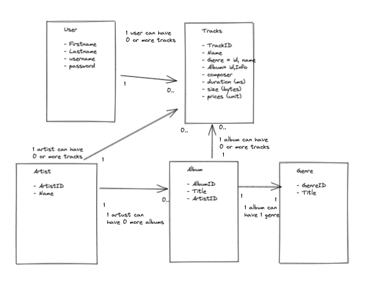

# ISDB-App

> This project follows on from IMDB (Internet Movie Database), launching and plan to sell on an ISDB (Internet Song Database). The collection includes more than 3000 tracks from 300+ albums.
> Live demo [_here_](https://deploy-isdb.herokuapp.com/). <!-- If you have the project hosted somewhere, include the link here. -->

## Table of Contents

- [General Info](#general-information)
- [Technologies Used](#technologies-used)
- [Features](#features)
- [Screenshots](#screenshots)
- [Setup](#setup)
- [DevelopmentStage](#Development-stage)
- [Usage](#usage)
- [Project Status](#project-status)
- [Room for Improvement](#room-for-improvement)
- [Acknowledgements](#acknowledgements)
- [Contact](#contact)
<!-- * [License](#license) -->

## General Information

> Purpose of the project is to design an API on ISDB. This is so customers can build various front ends needed to use the database.
> User Story:-
> [_here_](https://miro.com/app/board/uXjVOVHkNlY=/)
> This API provieds the folling endpoints:-

- /register
- /login
- /tracks/:id
- /genres
- /albums
- /tracks
- /artists/:id

- What problem does it (intend to) solve?
- Why did you undertake it?
<!-- You don't have to answer all the questions - just the ones relevant to your project. -->

## Technologies Used

- Node.js
- MongoDB
- Mongoose
- Express
- EJS
- eslint

## Features

List the ready features here:

- Awesome feature 1
- Awesome feature 2
- Awesome feature 3

## Screenshots

<!-- If you have screenshots you'd like to share, include them here. -->

## Setup

Project Deliverables

- A running Express/Mongo application deployed on heroku/mongodb with the mentioned routes and the data loaded in.
- A GitHub repo that includes README file.
- Supporting documentation and code.

Where are they listed? A requirements.txt or a Pipfile.lock file perhaps? Where is it located?

Proceed to describe how to install / setup one's local environment / get started with the project.

1. Using terminal:-

- Scaffold an express application `npm install -g express-generator` and launch VS code.
- Without going through all the steps install npm project `npm init -y`.
- Installed eslint used in two cases, adhere to set standard and how it was violated.
  ......

## Development Stage

15/01/22

1. What have you done so far

- Created the ISDB express app on vs code.
- Sketched a model diagram for the schema.
- Start user stories.
- Deploy express App and removed unused code.

2. What are you going to work on next

- Implement project data and create entities for tracks, albums, artists and genres.
- Define and create a Schema and model with reference to the model diagram.
- Create ejs files.

3. What blockers you have (if any)

- Create user stories for API.

## Usage

How does one go about using it?
Provide various use cases and code examples here.

`write-your-code-here`

## Project Status

Project is: _in progress_ / _complete_ / _no longer being worked on_. If you are no longer working on it, provide reasons why.

## Room for Improvement

Include areas you believe need improvement / could be improved. Also add TODOs for future development.

Room for improvement:

- Improvement to be done 1
- Improvement to be done 2

To do:

- Feature to be added 1
- Feature to be added 2

## Acknowledgements

Give credit here.

- This project was inspired by...
- This project was based on [this tutorial](https://www.example.com).
- Many thanks to...

## Contact

Created by [Stanton]() - feel free to contact me!

<!-- Optional -->
<!-- ## License -->
<!-- This project is open source and available under the [... License](). -->

<!-- You don't have to include all sections - just the one's relevant to your project -->
